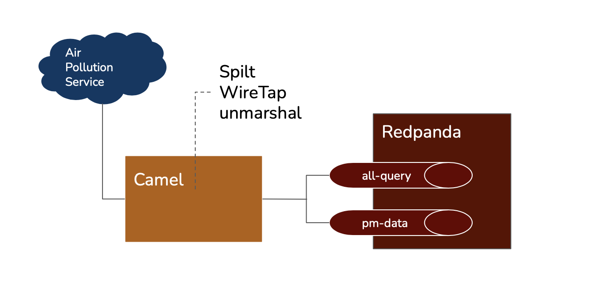
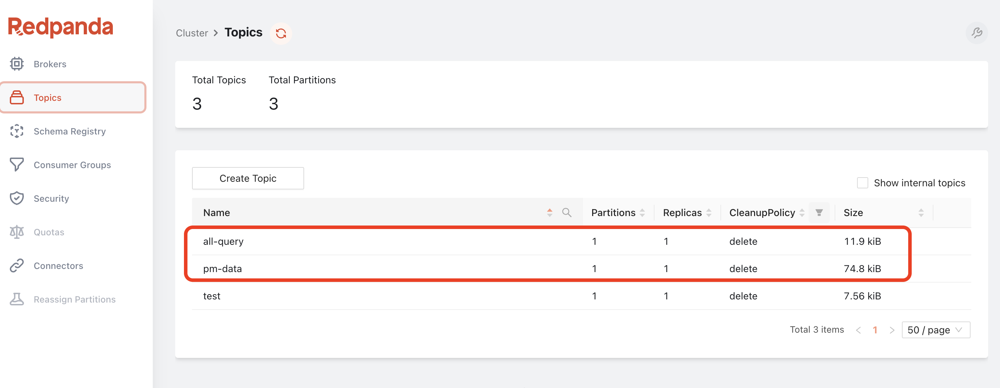
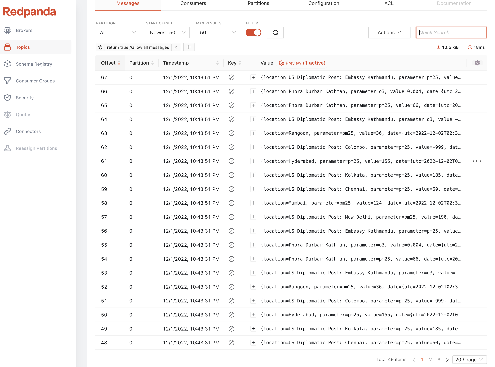
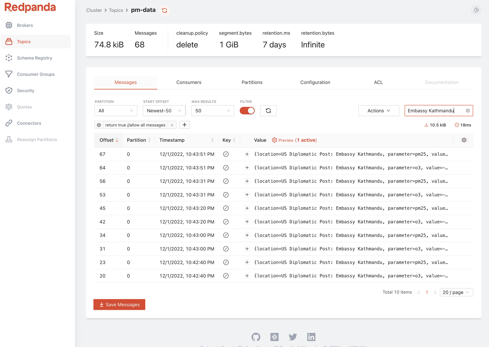

# Getting Started with Camel & Redpanda

This is a very simple getting started demo showcasing how Camel can integrate with Redpanda streaming data platform. 
Since Redpanda is Kafka-compatible, simply use the _kafka_ component in Camel. 

With the help of Camel JBang, we now can quickly run and test it locally. 


## Prerequisite
Install JBang[https://www.jbang.dev/download/] 

Check your JBang installation by running 

```
jbang version
```

Install Apache Camel command line tool within JBang

```
jbang app install camel@apache/camel
```

Check of the camel cli installation by running 
```
camel --help
```

## Running Redpanda and it's console

There are several ways to install Redpanda, such as installing a command line tool, but here I am simply going to use Docker to run it. 
Since this is a very simple demo for local, nothing terribly crazy going to happen to the cluster, all I need is a simple one-node cluster.

```
docker run -d \
--pull=always \
--name=redpanda \
--hostname=redpanda \
--net=redpanda \
-p 8081:8081 \
-p 8082:8082 \
-p 9092:9092 \
-p 9644:9644 \
-v "redpanda1:/var/lib/redpanda/data" \
vectorized/redpanda redpanda start \
--overprovisioned \
--smp 1  \
--memory 1G  \
--reserve-memory 0M \
--pandaproxy-addr INSIDE://0.0.0.0:28082,OUTSIDE://0.0.0.0:8082 \
--advertise-pandaproxy-addr INSIDE://redpanda:28082,OUTSIDE://localhost:8082 \
--kafka-addr INSIDE://redpanda:29092,OUTSIDE://0.0.0.0:9092 \
--advertise-kafka-addr INSIDE://redpanda:29092,OUTSIDE://localhost:9092 \
--rpc-addr 0.0.0.0:33145 \
--advertise-rpc-addr redpanda:33145
```

This step is optional. 
The Redpanda Console allow me to have more visibility to the information about deploying, configuring and even samples of data streamed. 

```
docker run --net=redpanda \
  --name=console \
  -e KAFKA_BROKERS=redpanda:29092 \
  -p 8080:8080 \
  docker.redpanda.com/vectorized/console:latest
```

## Running Camel

Make sure to clone the example repo

```
git clone https://github.com/weimeilin79/camelpanda101.git
cd camelpanda101
```

The demo is a simple application that pulls air pollution data from an Open API endpoint every 30 seconds. The problem was the data needed to be orchestrated and split into individual location, instead of a whole chunk. The Camel route will process and split the data into a _pm_data_ topic while implementing an _'Enterprise Integration Pattern(EIP)'_ call *WireTap*, that has fixed Recipient List with two output channels. In this case it logs the original data received via the SaaS service to another _all-query_ topic. This pattern is commonly used for testing or auditing, where the same input needs to be sent to multiple destinations. 



To run the camel application:
```
camel run AirQualityConsumer.java
```

## Results

Notice in the Camel route _AirQualityConsumer.java_, we are simply using the kafka component to interact with Redpanda,

```
wireTap("kafka:all-query?brokers=localhost:9092")
...
    .to("kafka:pm-data?brokers=localhost:9092");
```

And the use of several EIP, such as unmarshal to Ttansforms data in textual format, 
```
.unmarshal().json()
```


Use Splitter to break out the composite message into a series of individual messages, 
```
.split().simple("${body[results]}")
```

To see the result message, go to *Redpanda Console* select the Topic on the left menu, and you will see there are two topics listed 
- all-query
- pm-data



Click into pm-data, you will see all the Air Pollution data from individual meters. 


Do a quick search to find the city that may interest you. 



That's all! Good luck! 